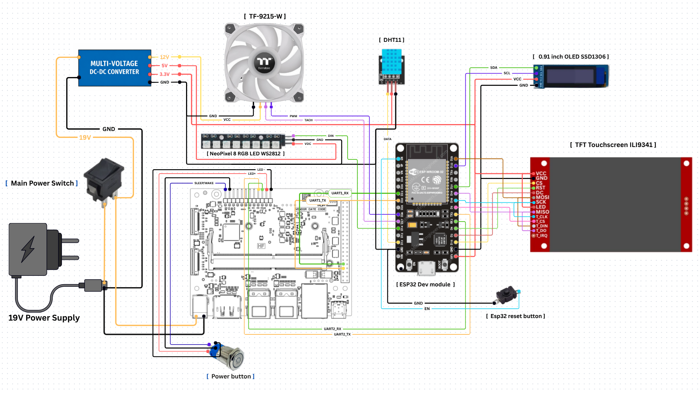
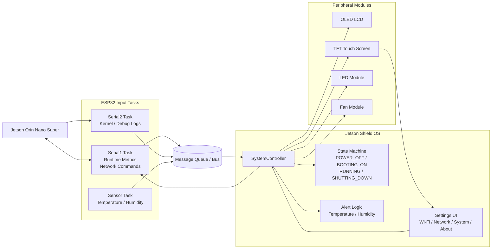
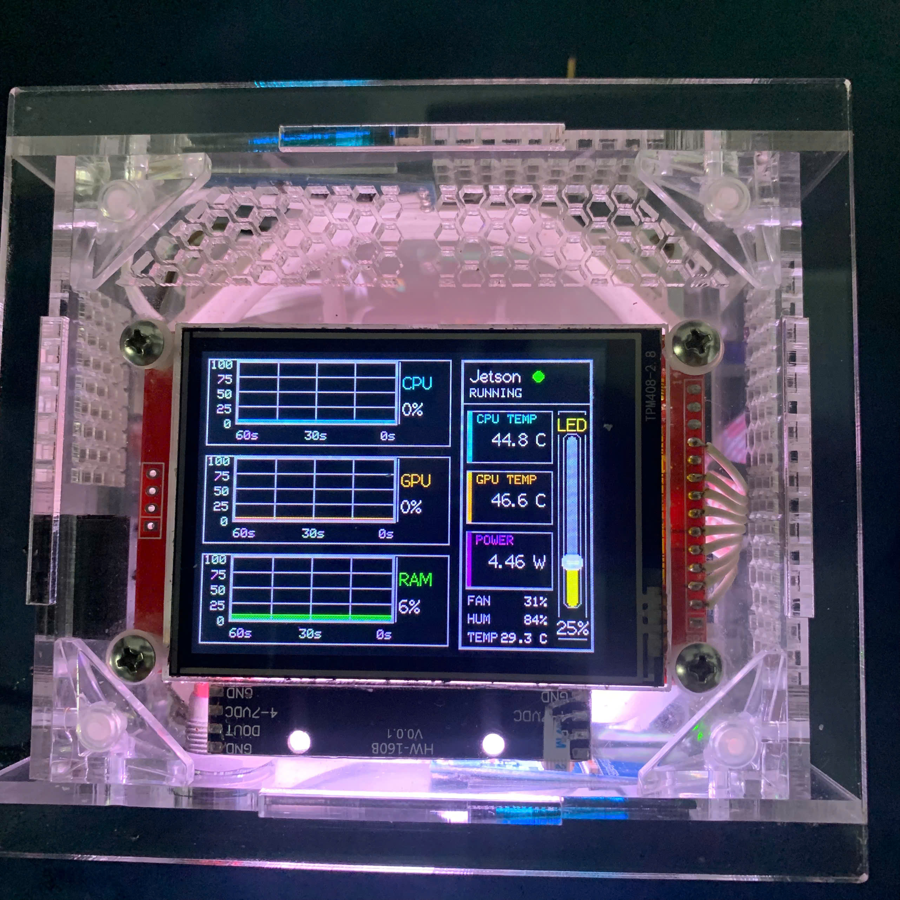
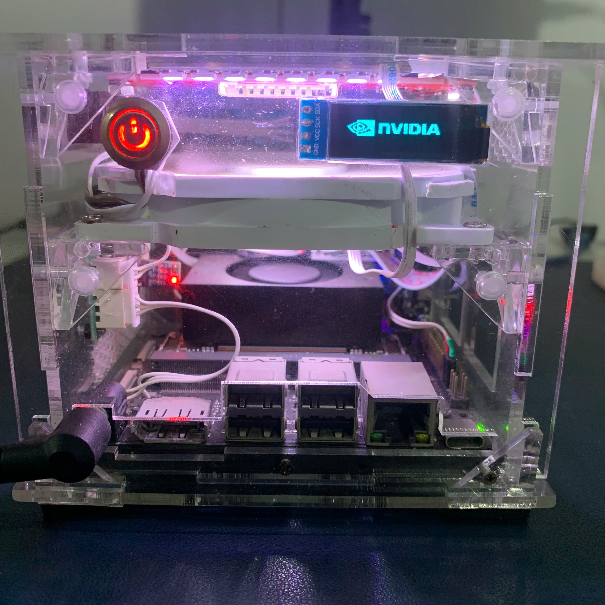
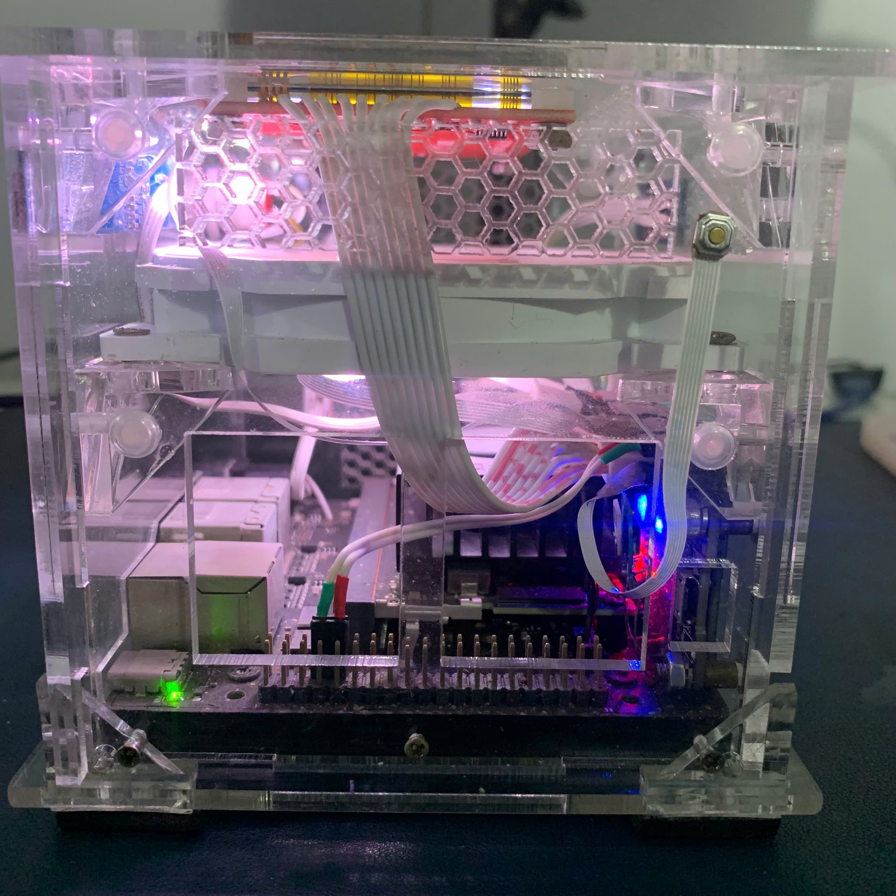
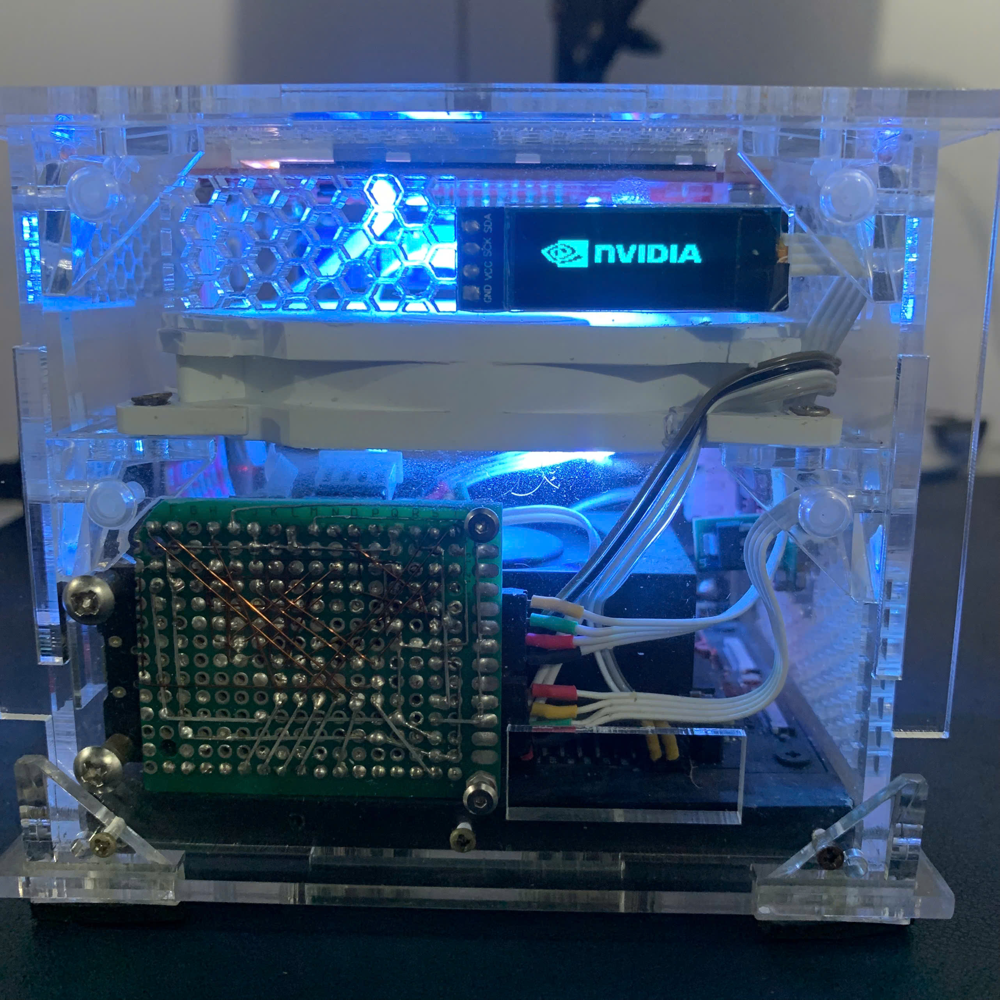
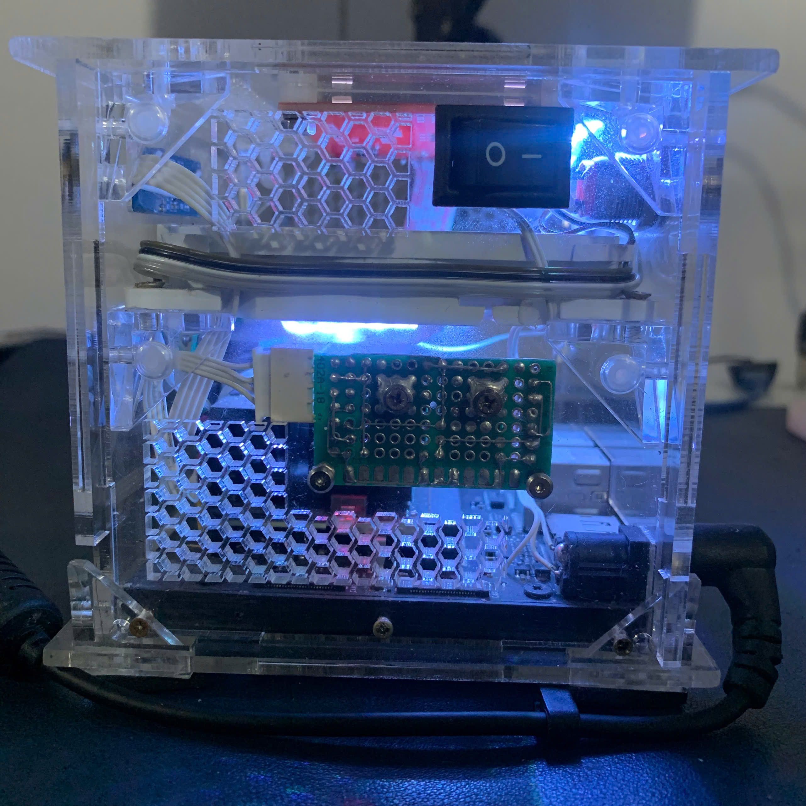
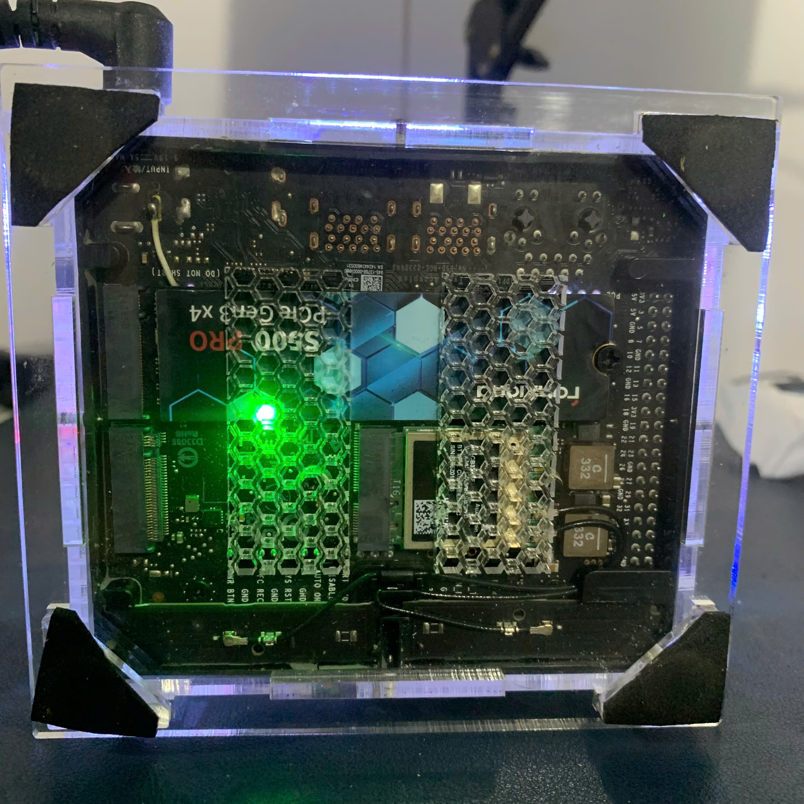

# Jetson Shield OS

## Project Introduction

Jetson Shield OS is a transparent enclosure project for the Jetson Orin Nano Super. An ESP32 acts as a companion controller connected to the Jetson through two serial links. Serial1 is the bidirectional runtime/settings channel: the Jetson streams compact metrics to the ESP32, and the ESP32 sends predefined settings requests for network status, Wi-Fi scan/connect, SSH/ngrok status and control, headless mode, monitor restart, reboot, and shutdown. Serial2 is a receive-only kernel/debug channel used for boot and shutdown state detection. The ESP32 presents system status, alerts, settings, boot/shutdown activity, and POWER_OFF mini-games across local displays, lighting, and cooling hardware.

## Hardware

- Jetson Orin Nano Super
- ESP32
- Transparent case / shield enclosure
- PWM fan
- LEDs
- OLED LCD
- TFT touch screen
- Sensors
- Buttons
- Switches

### UART Wiring Summary

- ESP32 Serial1 RX GPIO25 receives Jetson runtime metrics.
- ESP32 Serial1 TX GPIO17 sends settings commands to the Jetson.
- ESP32 Serial2 RX GPIO16 receives Jetson kernel/debug logs.
- Serial2 TX is not required by the current architecture.

## Hardware Diagram

<p align="center">
  
</p>

## Software Diagram



Additional assembly and design image galleries are collected in [docs/README.md](docs/README.md).

## Rendering Notes

LCD_2 uses a mixed TFT_eSPI rendering model. Dashboard plot regions use 8-bit sprites, boot/shutdown logs and POWER_OFF games use 1-bit sprites, and remaining direct-drawn dynamic UI regions are being tracked for anti-flicker refactoring. See [docs/TFT_eSPI_RENDERING_GUIDE.md](docs/TFT_eSPI_RENDERING_GUIDE.md) and [docs/LCD2_FLICKER_REFACTOR_PLAN.md](docs/LCD2_FLICKER_REFACTOR_PLAN.md).

## Demo Images

<p align="center">
	
	
</p>

<p align="center">
	
	
</p>

<p align="center">
	
	
</p>

## Video

[](https://youtu.be/KmZ7pbCNbDI)

Watch the short demo here: https://youtu.be/KmZ7pbCNbDI

## Setup Guide

### 1. Create the Jetson service

The `jetson_shield_bridge.c` program reads Jetson stats from `tegrastats`, adds network/disk/swap metrics, sends compact status lines to the ESP32, and handles predefined UART requests from the ESP32 for IP status, Wi-Fi scanning/connection, SSH/ngrok status and control, headless mode, monitor restart, reboot, shutdown, and about information. It does not expose arbitrary shell execution over UART.

Build it on Jetson:

```bash
gcc -O2 -s -o jetson_shield_bridge jetson_shield_bridge.c
```

Copy the binary and service file into place:

```bash
sudo cp jetson_shield_bridge /usr/local/bin/jetson_shield_bridge
sudo cp jetson_shield.service /etc/systemd/system/jetson_shield.service
sudo systemctl daemon-reload
sudo systemctl enable --now jetson_shield.service
```

Check that it is running:

```bash
sudo systemctl status jetson_shield.service
sudo journalctl -u jetson_shield.service -f
```

If your Jetson UART device is different, set `SYSTEM_MONITOR_UART` in `/etc/default/jetson_shield` before enabling the service. The default is `/dev/ttyTHS1`. Optional service settings include `SYSTEM_MONITOR_DISK`, `SYSTEM_MONITOR_TEGRASTATS_CMD`, `SYSTEM_MONITOR_SSH_SERVICE`, `SYSTEM_MONITOR_NGROK_SERVICE`, `SYSTEM_MONITOR_SELF_SERVICE`, and `SYSTEM_MONITOR_NGROK_API`.

### 2. Upload the ESP32 code

The ESP32 firmware is inside the `Jetson_shield_os/` folder.

1. Copy the whole `Jetson_shield_os/` folder into your Arduino sketches directory.
2. Open `Jetson_shield_os.ino` in Arduino IDE.
3. Select the correct ESP32 board and port.
4. Click Upload.

After uploading, connect the ESP32 to the Jetson and start the `jetson_shield` service so the two sides can exchange data. Serial1 is bidirectional for metrics and settings commands; Serial2 only needs the Jetson-to-ESP32 direction for kernel/debug logs.
