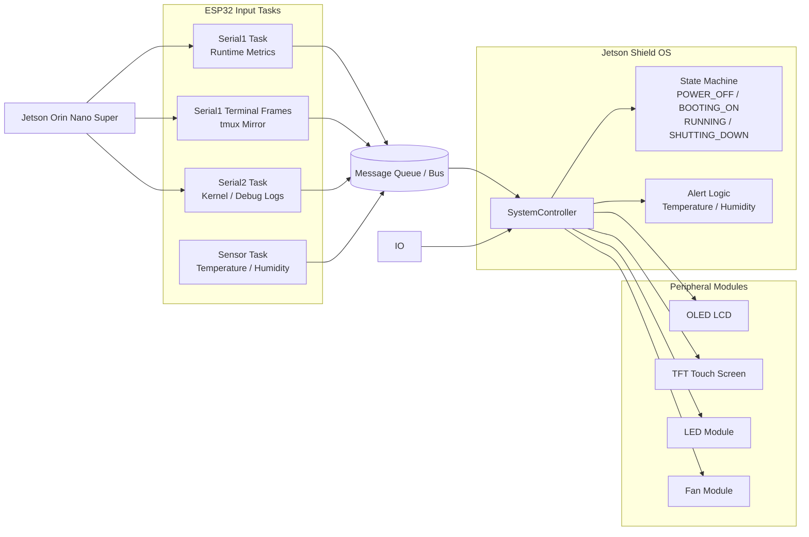
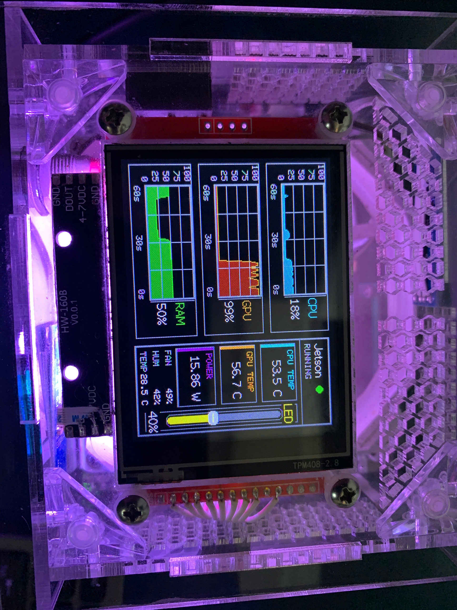
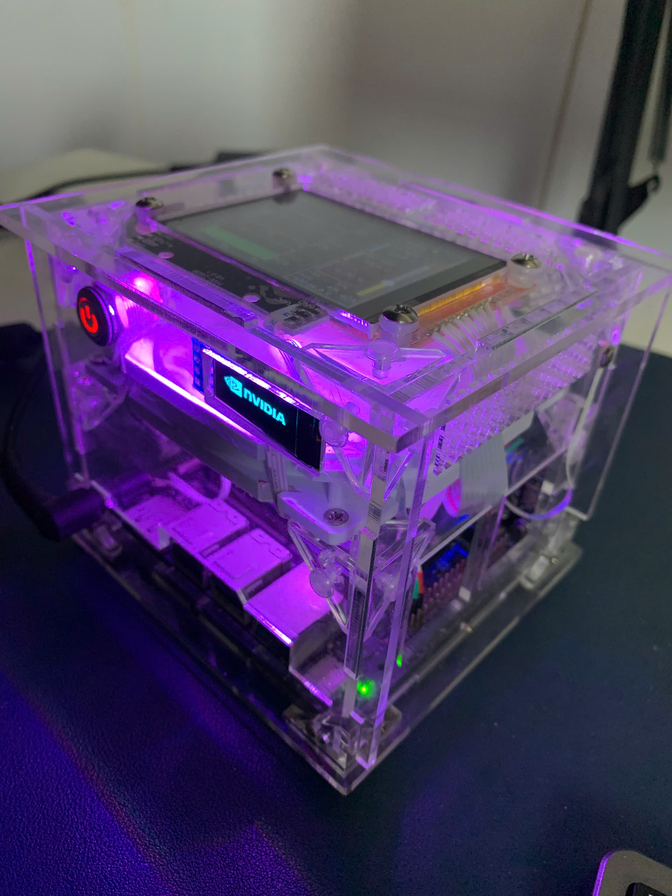
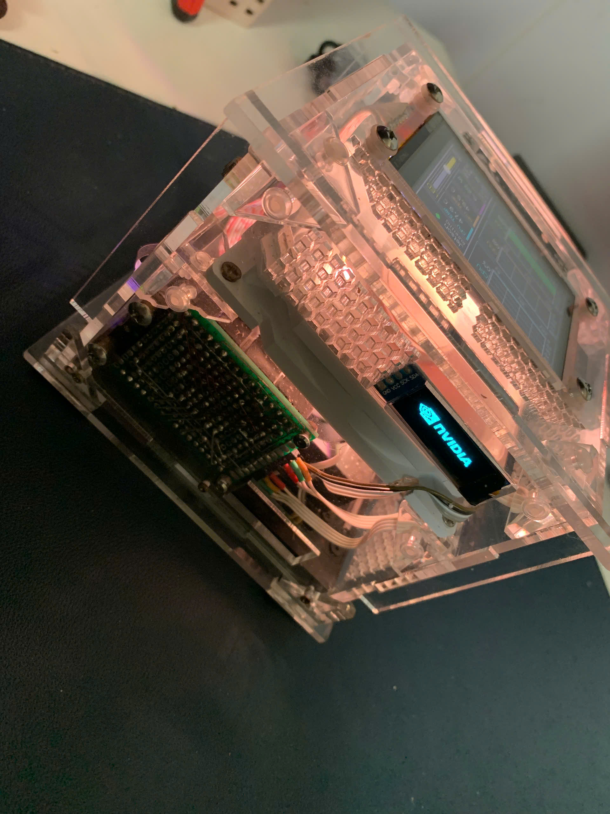
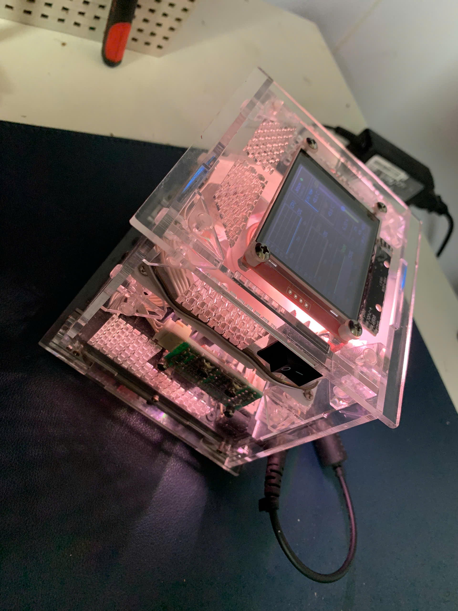
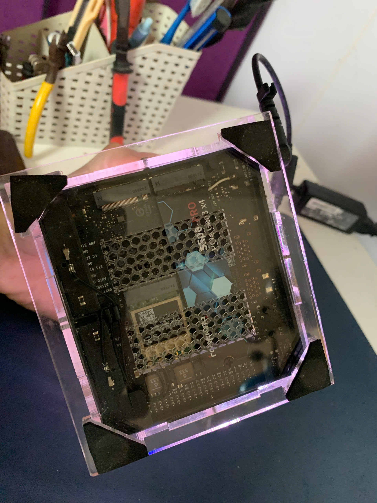

# Jetson Shield OS

## Project Introduction

Jetson Shield OS is a transparent enclosure project for the Jetson Orin Nano Super. An ESP32 acts as a companion controller connected to the Jetson through two serial ports: one channel carries runtime parameters and the LCD_2 terminal bridge, and the second channel captures kernel and debugging messages. The ESP32 then presents system status, alerts, terminal sessions, and boot or shutdown activity across local displays, lighting, and cooling hardware.

## Hardware

- Jetson Orin Nano Super
- ESP32
- Transparent case / shield enclosure
- PWM fan
- LEDs
- OLED LCD
- TFT touch screen
- Sensors
- Buttons
- Switches

## Program

Additional assembly and design image galleries are collected in [docs/README.md](docs/README.md).

## Demo Images

  
  
  
  
  

## Video

Watch the short demo here: https://youtube.com/shorts/HfWqUJrVQeM
