# Documentation Gallery

This page collects the design and assembly images for quick browsing on GitHub.

## Design Diagrams

<b>Frame 1: Design Diagrams 1-6</b>

1. 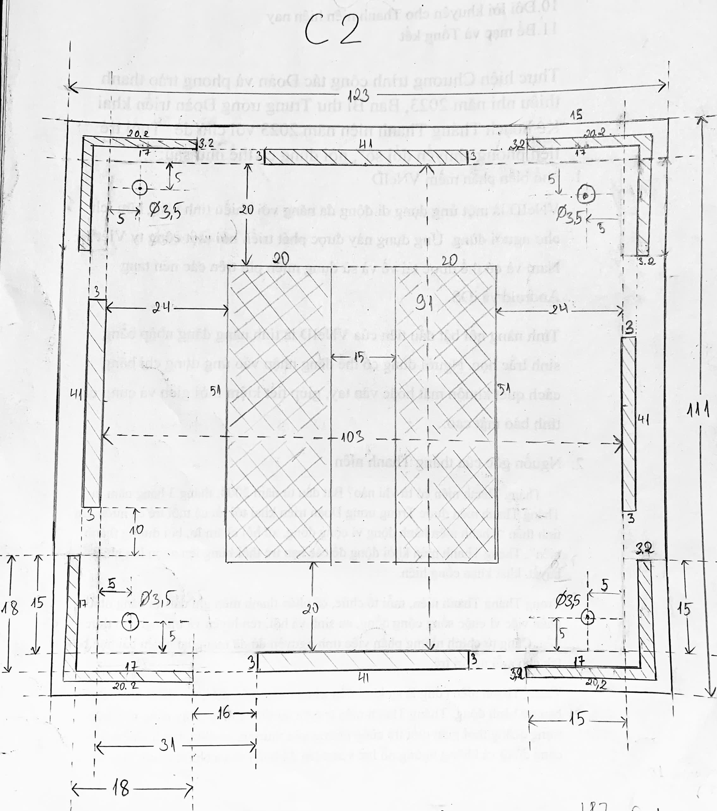
2. 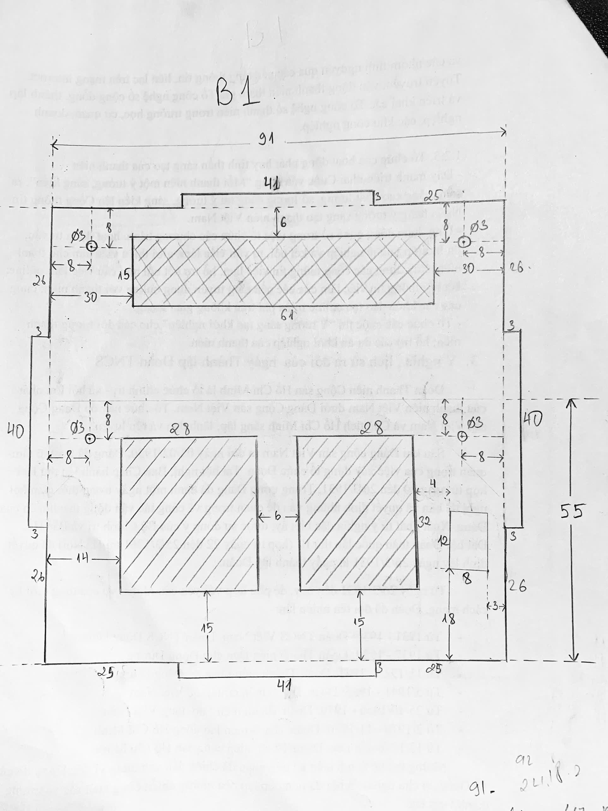
3. 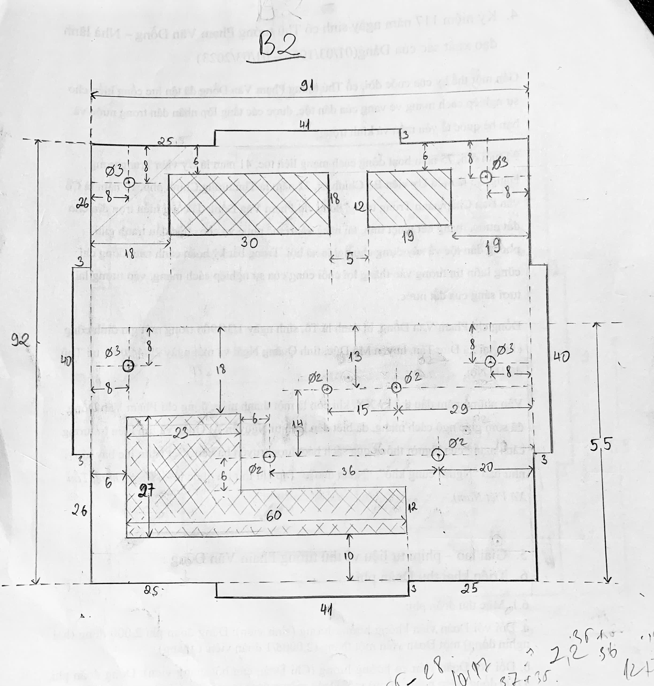
4. 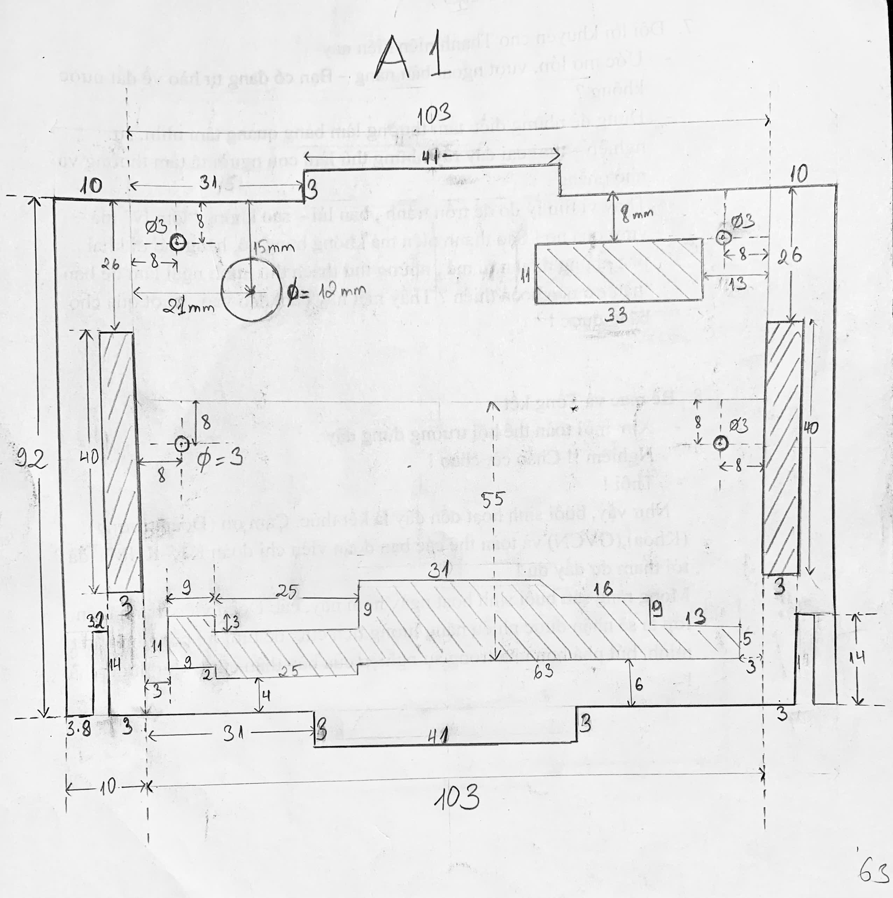
5. 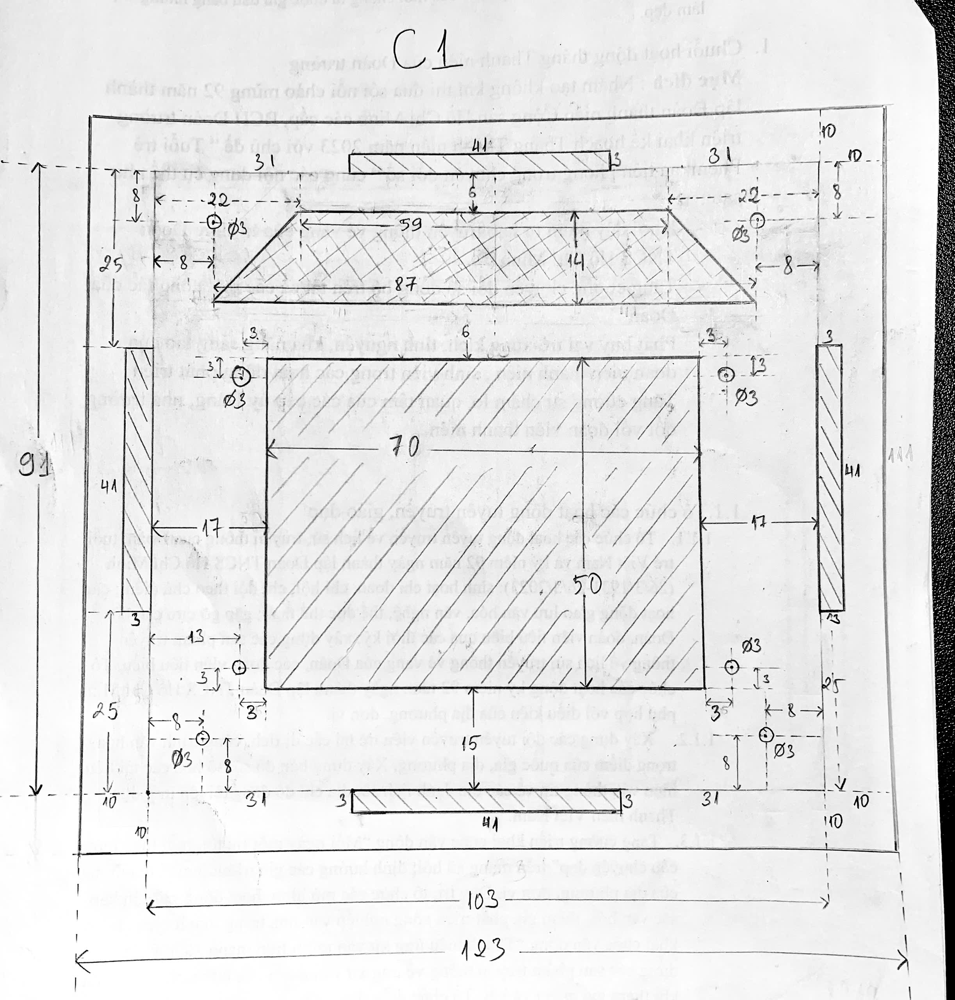
6. 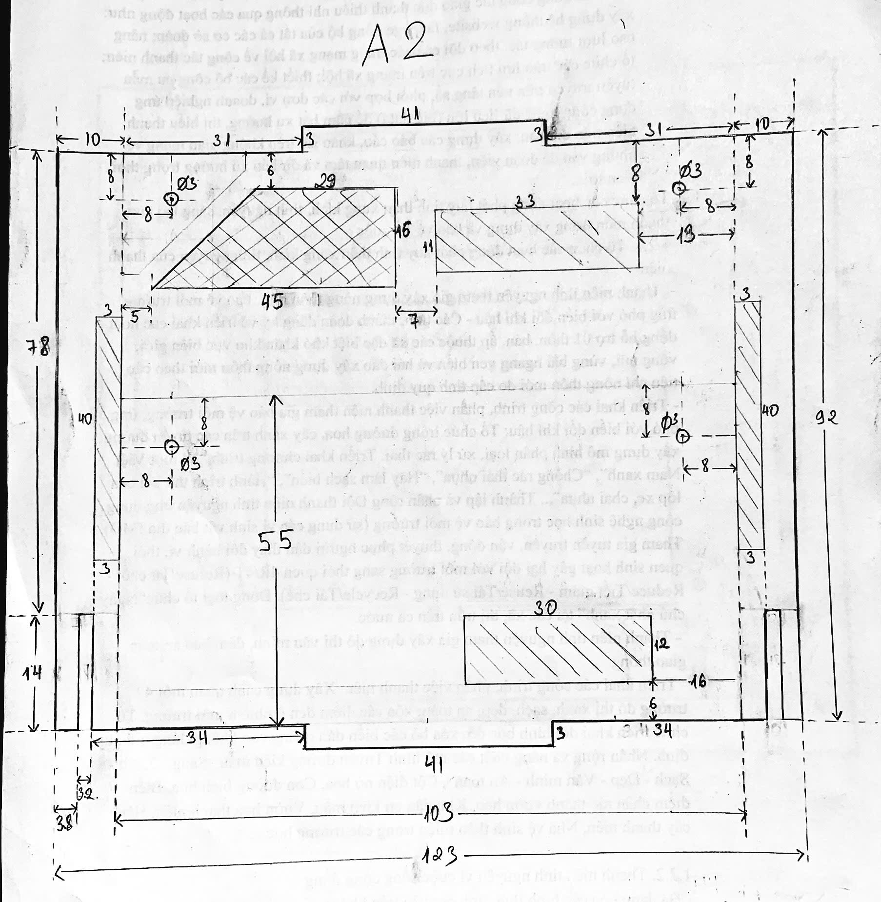

<b>Frame 2: Design Diagrams 7-12</b>

7. 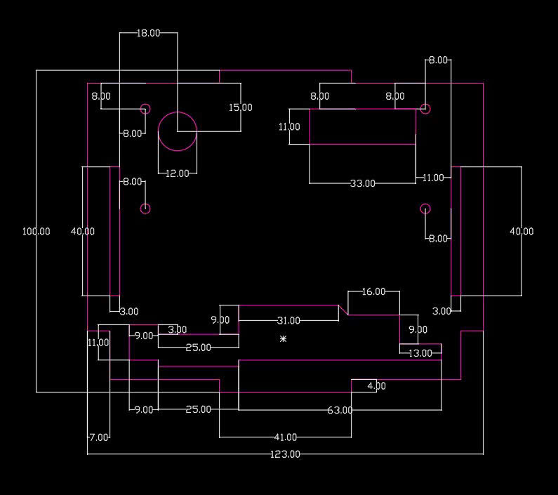
8. 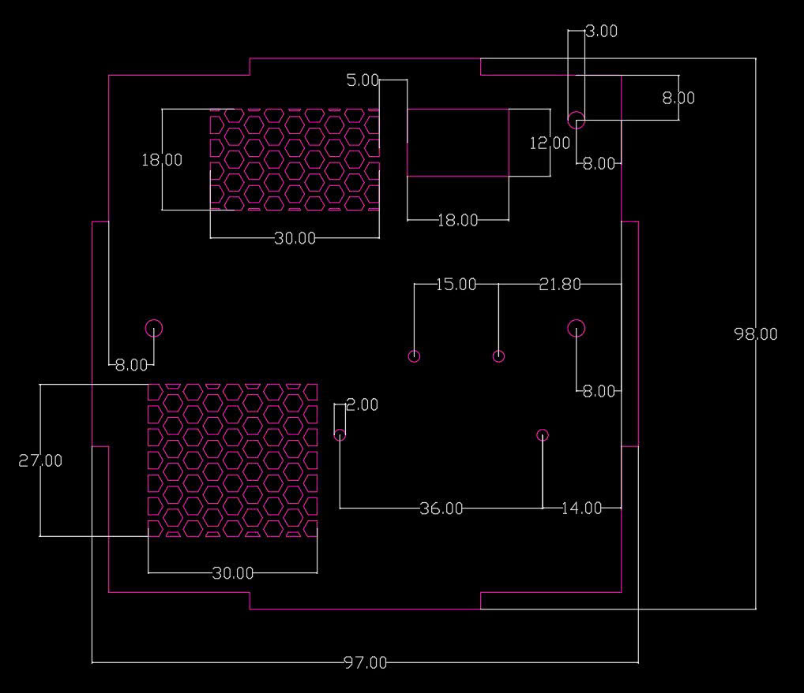
9. 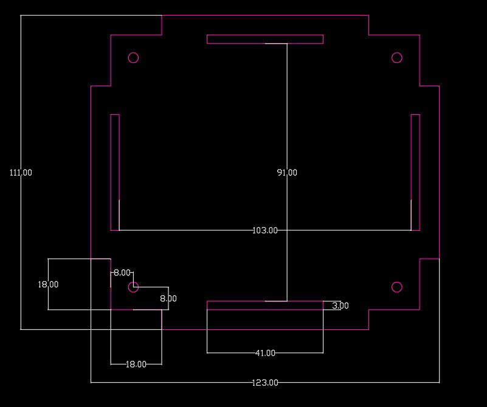
10. 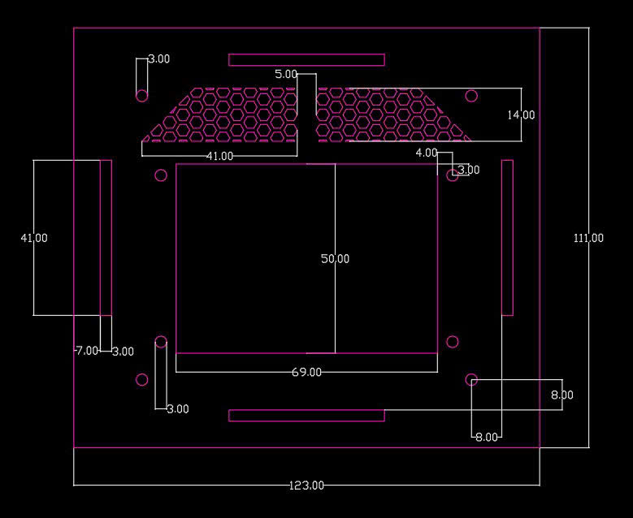
11. 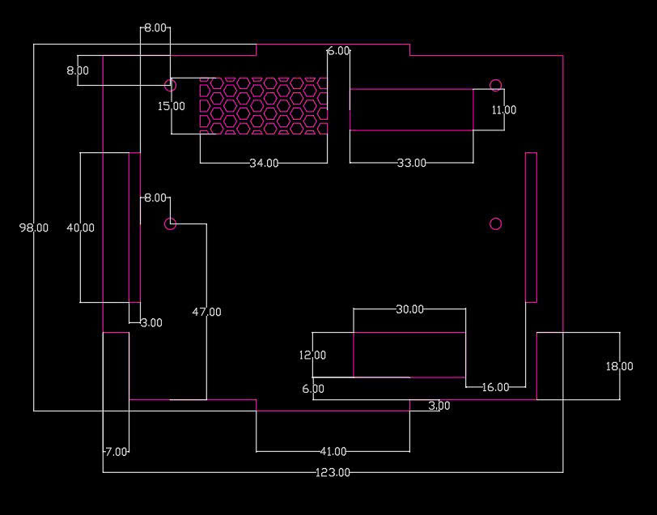
12. 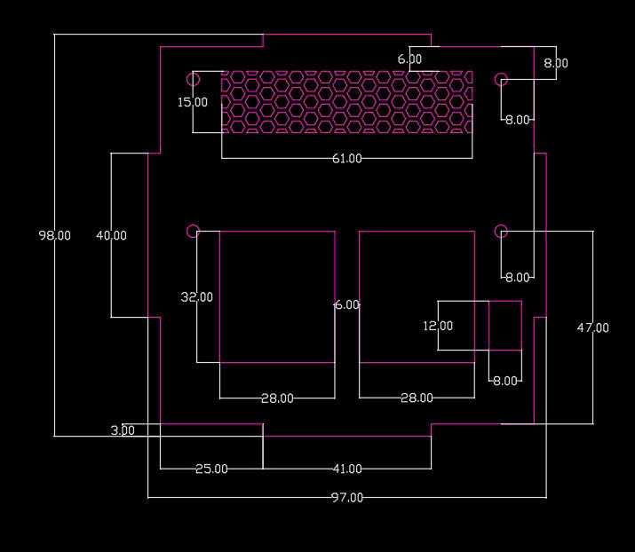

## Assembly Process

Overview:

<b>Frame 1: Assembly Steps 1-4</b>

1. 
2. 
3. 
4. 

<b>Frame 2: Assembly Steps 5-8</b>

5. 
6. 
7. 
8. 

<b>Frame 3: Assembly Steps 9-12</b>

9. 
10. 
11. 
12. 

<b>Frame 4: Assembly Steps 13-16</b>

13. 
14. 
15. 
16. 

<b>Frame 5: Assembly Steps 17-20</b>

17. 
18. 
19. 
20. 

<b>Frame 6: Assembly Steps 21-24</b>

21. 
22. 
23. 
24. 

<b>Frame 7: Assembly Steps 25-28</b>

25. 
26. 
27. 
28. 

<b>Frame 8: Assembly Step 29</b>

29. 

